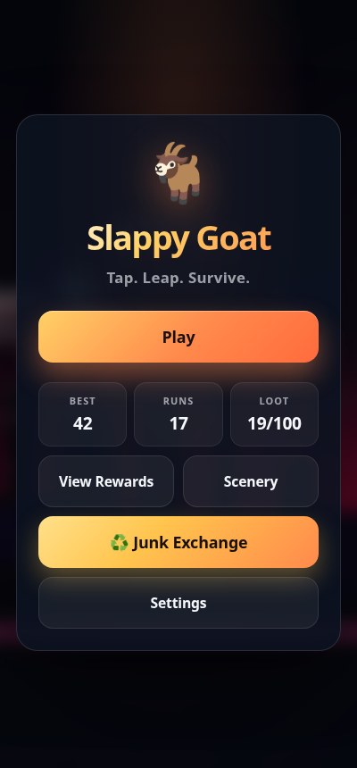
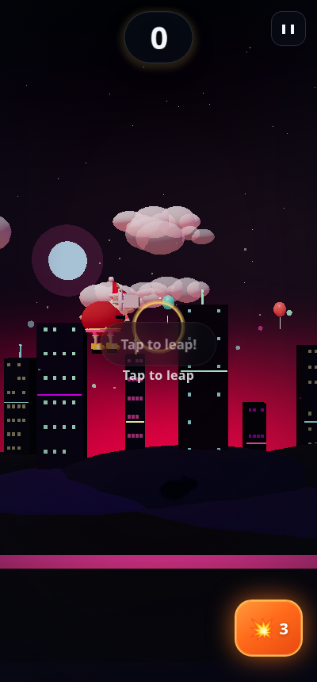
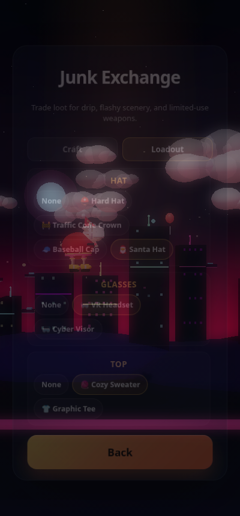
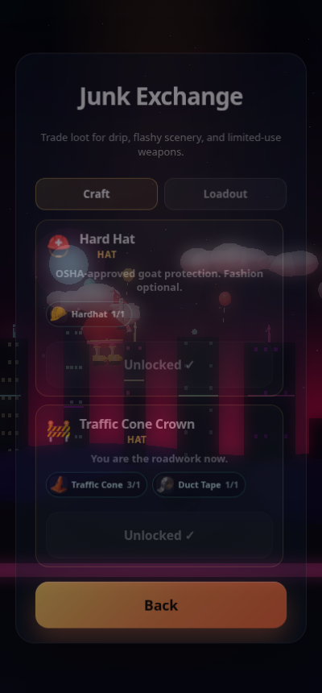
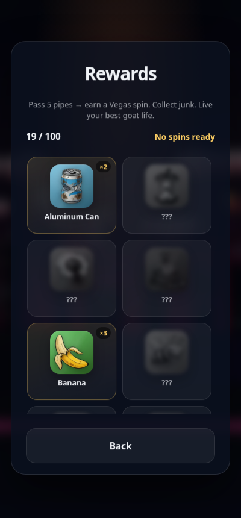
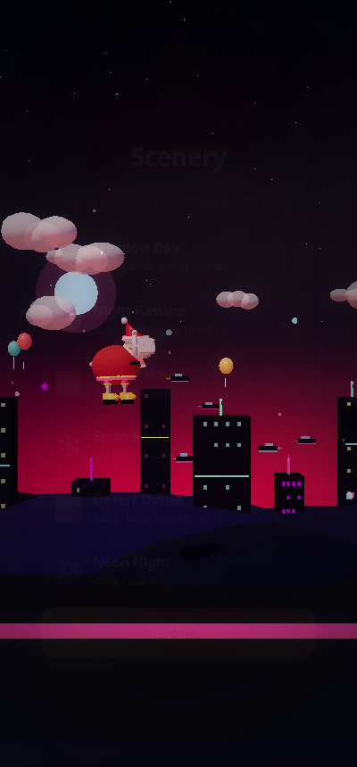

# Slappy Goat

**Tap. Leap. Survive. Collect junk. Flex drip.**  
A portrait Android Flappy-style game starring a 3D goat, a 100-item sidewalk loot catalog, craftable cosmetics & weapons, and flashy animated scenery — including unlockable **Cyberpunk District**.

<p align="center">
  
  
</p>
<p align="center">
  
  
</p>
<p align="center">
  
  
</p>

---

## About the game

You are a goat with questionable life choices and excellent vertical commitment.  
Tap to leap through pipes. Miss, and gravity writes the eulogy.

Pass **5 pipes** to earn a **Vegas spin** and stockpile absurdist sidewalk loot — plastic bags, radioactive hotdogs, mystery liquids, and ~100 other treasures. Trade that junk at the **Junk Exchange** for hats, tops, pants, shoes, glasses, weapons, and a premium cyberpunk world.

### Features

| Feature | Description |
|--------|-------------|
| **3D goat** | Stylized Three.js goat with flapping ears, kicking legs, and bleats |
| **Portrait play** | Built for phones, locked portrait orientation |
| **100 junk rewards** | Image-based loot catalog; duplicates stack for crafting |
| **Junk Exchange** | Craft gear from loot combinations |
| **Loadout** | Equip hat, glasses, top, pants, shoes, and weapon |
| **Cosmetics** | Santa / baseball / hard hat / cone · VR headset · sweaters & tees · jeans & party shorts · yellow sneakers & work boots |
| **Weapons** | Pipe Blaster (bolts) or Laser Shooter (glowing beams) — **3 shots per run** |
| **Scenery themes** | Meadow, Night, Golden Hour, Snow, Desert, Neon Night + unlockable **Cyberpunk District** |
| **Cyberpunk world** | Neon skyline, flying vehicles, fireworks, rocket launches, multicolor glowing pipes |
| **Juice** | Particles, haptics, procedural SFX/music, confetti on new bests |
| **Offline** | Bundled Three.js — no network needed to play |

### Controls

| Action | Input |
|--------|--------|
| Start | **Play** / **Play Again** |
| Leap | Tap the screen (during a run) |
| Fire weapon | 💥 button (bottom left or right) · desktop: **F** / **Shift** |
| Pause | ❚❚ button |
| Scenery | Home → **Scenery** |
| Collection | Home → **View Rewards** |
| Craft / equip | Home → **Junk Exchange** |

### Junk Exchange (examples)

| Craft | Needs (examples) |
|-------|------------------|
| Party Shorts | Banana + Spaghetti |
| Work Boots | Cinderblock + Board with Nails |
| VR Headset | Broken Glass + Broken iPhone |
| Laser Shooter | Nail Gun + Broken iPhone + Leaky Battery |
| Cyberpunk District | Virus + COVID + phone + cables + USB |

Owned loot shows in color; locked rewards stay greyed until you spin them. Crafting **consumes** stacked junk.

---

## Download

**Android APK (debug build):**

- [`dist/SlappyGoat.apk`](dist/SlappyGoat.apk)

Install with:

```bash
adb install -r dist/SlappyGoat.apk
```

Or copy the file to your phone and open it (allow install from unknown sources).

> Package ID: `com.slappybird.goat` · Min SDK 24

---

## Play in browser

```bash
cd www
python3 -m http.server 8765
```

Open [http://localhost:8765](http://localhost:8765) (use a tall window / phone mode).

Optional screen deep-links for testing: `?screen=rewards`, `trade`, `loadout`, `scenery`, `play`.

---

## Build from source

Requirements: Node.js, JDK 17+, Android SDK.

```bash
export JAVA_HOME=/path/to/jdk   # e.g. Android Studio JBR
export ANDROID_HOME=/path/to/Android/Sdk
export PATH="$JAVA_HOME/bin:$PATH"

npm install
npx cap sync android
cd android && ./gradlew assembleDebug
```

APK output:

```text
android/app/build/outputs/apk/debug/app-debug.apk
```

Copy to dist:

```bash
cp android/app/build/outputs/apk/debug/app-debug.apk dist/SlappyGoat.apk
```

### Emulator

```bash
emulator -avd SlappyGoat_Phone -gpu host   # or your AVD name
adb install -r dist/SlappyGoat.apk
adb shell am start -n com.slappybird.goat/.MainActivity
```

---

## Project layout

```text
slappy-goat-android/
├── www/                    # Game (HTML / CSS / Three.js)
│   └── assets/
│       ├── rewards/        # 100 loot images
│       └── background/     # Rocket art for Cyberpunk
├── android/                # Capacitor Android shell
├── dist/SlappyGoat.apk     # Installable build
├── docs/                   # Screenshots
├── Game Assets/            # Source loot art
├── Background Assets/      # Source background art
├── capacitor.config.json
└── package.json
```

### Stack

- [Three.js](https://threejs.org/) r170 (bundled)
- [Capacitor](https://capacitorjs.org/) Android WebView
- Vanilla JS — no game framework

---

## License

MIT — go forth and slap responsibly.
